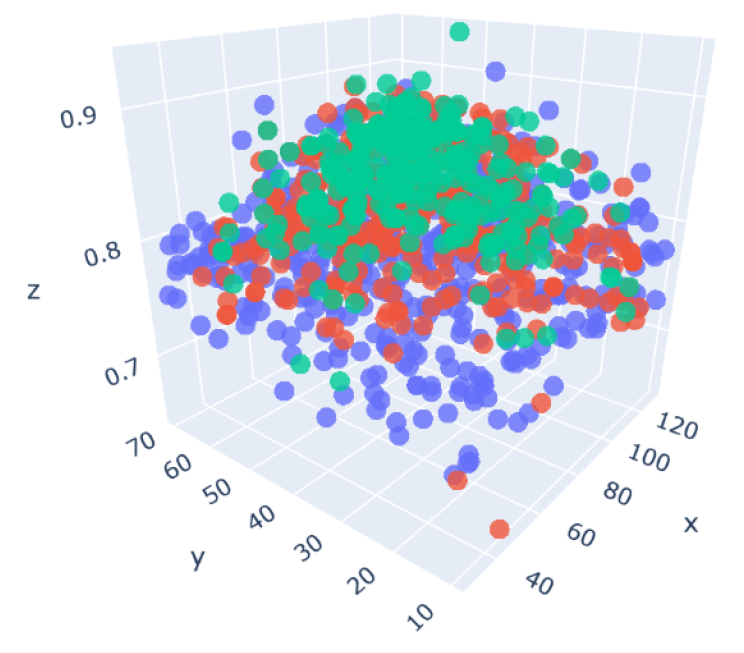
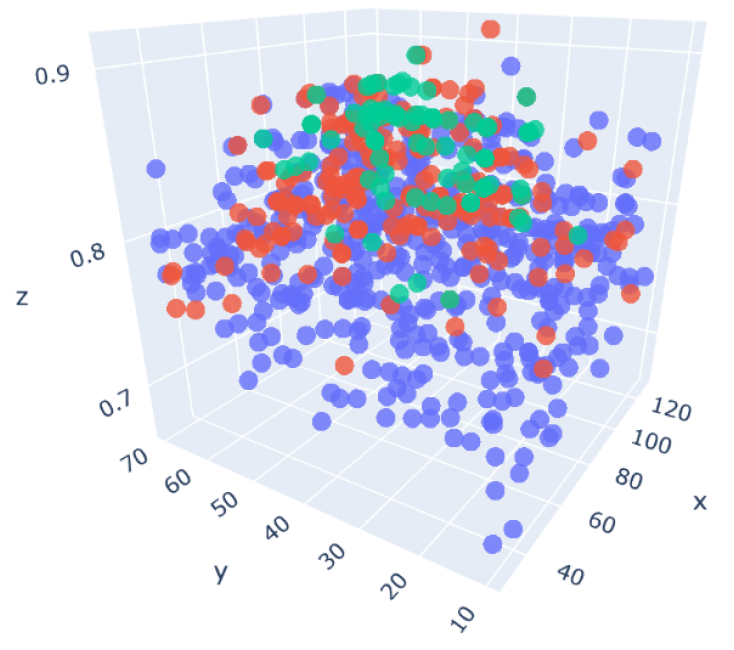
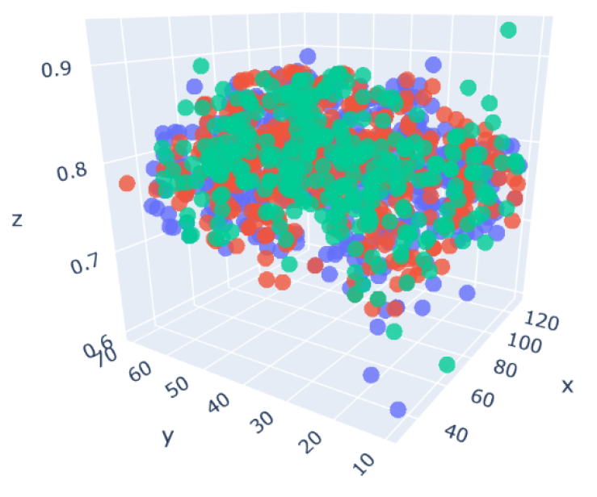

# Mutation Misery

Hyperparameter selection for machine learning models remains one of the most critical parts in data
science projects. It is a widely researched field in science that still has lots of potential
for improvement.

Among classical methods like grid search, random search and Bayesian optimization other algorithms
have been tested to improve results and yield higher efficiencies. One of them is the hyperparameter
optimization based on evolutionary algorithms which has already proved to be more successful than
e.g. Bayesian optimization in some cases [1].

It is based on Darwins’ evolution theory and comprises the reproduction via cross selection and the 
survival of fittest individuals in a population.

This project focuses on the hyperparameter tuning of neural networks and will highlight the
effect of different population reproduction patterns on optimization results. All networks are measured based
on their classification accuracy on scikit-learn’s Iris dataset.

### Results

#### Balanced reproduction - Shrinking

* Population sizes = 500, 400, 320
* Survival ratio = 0.4
* Mating best ratio = 0.3
* Mating lucky ratio = 0.1

#### Balanced reproduction - Strong shrinking

* Population sizes = 500, 200, 80
* Survival ratio = 0.2
* Mating best ratio = 0.15
* Mating lucky ratio = 0.05

#### Only random offset - Shrinking

* Population sizes = 500, 400, 320
* Survival ratio = 0.0
* Mating best ratio = 0.0
* Mating lucky ratio = 0.8

### References

[1] https://arxiv.org/abs/1904.06960